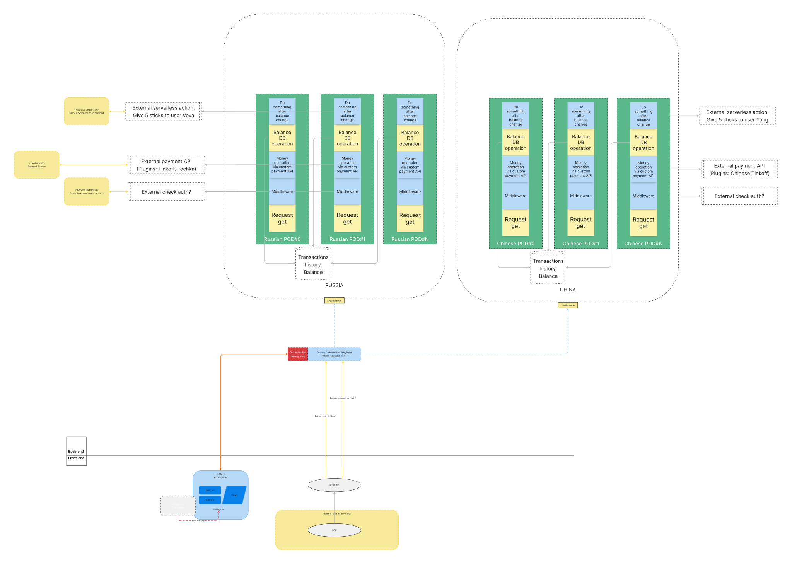

# Summary

## Problem

There are no open-source plug-and-play solutions for virtual currencies on the market. Developers have to create their own systems from scratch and deal with reliability, performance, law and other problems. This significantly increases development cost.

## Solution

Open source system for adding custom virtual currency to one’s project. Developers only need to deploy the system and configure it via web GUI (similar to Jenkins one).

Also developers get a lot of metrics and charts inside of the GUI.

# Stakeholders

1. Game Developers  
2. Game Investors  
3. Players  
4. Banking organizations

# Features

1. Modifiable ready-to-use payment pipeline. The core of our service is pipeline: entry point \-\> middleware \-\> real money payment \-\> virtual currency operation \-\> callbacks.  
2. Plugins for external payment services. Our service doesn’t create its own payment service, but uses others via plugin support.  
3. Plugins for middleware services. Our service can have middleware modifications. For example, when you want to check authorization access before doing any operations.  
4. Frontend Admin Panel. Our service has a frontend web GUI solution for easier administration.  
5. Authorization (access to the control panel of our service). Our service has its own authorization mechanism to restrict management logic.  
6. Storage for users’ transactions, requests, responses, balances of virtual currencies.   
7. REST API. We have a REST API to communicate with our service.  
8. Ready-to-use game SDK. Our SDK already has implementations for REST API endpoints, just add it into your game engine and use.  
9. Game demo for testing common scenarios of using virtual currency.

# Constraints

1. **Security** The system must provide secure access to system data including configurations. It will be achieved via authentication, authorization and ensuring the security of infrastructure components.  
2. **Source code’s maintainability.** The system should be designed for easy feature additions and new integrations. This will be achieved through a multi-tiered architecture, ensuring that each component has distinct, non-overlapping functionality, thereby increasing system flexibility.  
3. **Runtime pipeline’s extensibility.** By using a control panel admin can add or remove plugins from pipelines, thereby increasing system flexibility.  
4. **Usability for Admins.** The service must support admin web UI. The UI must be friendly, so any admin can navigate easily.  
5. **Usability for Users**. The service must support the REST API for communication with games’ SDKs.  
6. **Reliability**  
   1. **Availability**: The service has to provide a high level of SLA (e. g. 99.9%) and be reachable/available as much time as possible, even during pipeline modifications.  
   2. **Recoverability**: The system must be able to restore to a functional state after failures within no longer period than. Regular back ups of configurations, results of currency operations must be provided, too. No transactions should be lost\! Balance of virtual currency should be equal to real money spent on it.  
7. **Observability** For maintainers debug logging and tracing must be provided. For admins, dashboards, logs should be provided.

## Architecture

### Draft

